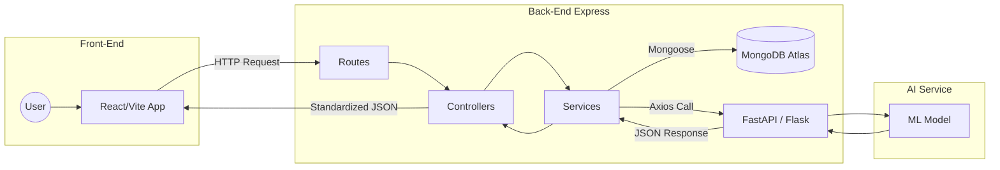

# Markdown Test Suite

This document contains a complete set of advanced Markdown elements—including GitHub Flavored Markdown (GFM) tables, LaTeX mathematical equations, Mermaid UML diagrams, code blocks, and custom formatting—to thoroughly verify your editor's live compiler pipeline.

---

## 1. Typography & Inline Elements

This sentence tests **bold text**, _italic text_, ~~strikethrough text~~, `inline code blocks`, and a [hyperlink to the index](https://rafifmsn.com).

> **Important Note:** This is a blockquote testing indentation styling. It should look distinct from standard paragraphs and render cleanly in the preview pane.

---

## 2. Advanced Tables (GFM Layouts)

This table verifies alignment rules, header borders, and multi-line item tracking inside the `remark-gfm` parser.

| System ID    | File Name          | Size (Bytes) | Storage Engine | Operational Status |
| :----------- | :----------------- | :----------: | :------------- | :----------------: |
| `01KGK9DBCY` | `README.md`        |    1,420     | IndexedDB      |     🟢 Active      |
| `1770173935` | `architecture.pdf` |  2,405,122   | Blob Cache     |    📎 Attached     |
| `3A7x9Wkz`   | `schema.png`       |   512,096    | Blob Cache     |    👁️ Previewed    |
| `0000004095` | `backup.zip`       |    12,401    | Local Export   |    ⚡ Compiled     |

---

## 3. LaTeX Mathematical Expressions (`remark-math` / `rehype-katex`)

### Inline Formula

The system packs the timestamp and the sequence into a unified integer boundary using the equation $E = (T \times 4096) + S$, ensuring a fixed-length string.

### Block Equation

This multi-line matrix calculation verifies block rendering, alignment operators (`&`), and deep mathematical fractions:

$$
\begin{aligned}
\text{Unique Integer} &= (\text{Unix Seconds} \times 4096) + \text{Sequence ID}
\end{aligned}
$$

---

## 4. Code Blocks with Syntax Highlighting (`@shikijs/rehype`)

### TypeScript Driver Module

```typescript
import { db } from "../utils/db";

export async function resolveShortLink(id: string): Promise<string> {
  // Decode operations occur entirely client-side using pure math
  const combinedInteger = base62Decode(id);
  const timestampSec = Math.floor(combinedInteger / 4096);
  const sequenceId = combinedInteger % 4096;

  const record = await db.files.get({
    timestamp_sec: timestampSec,
    sequence_id: sequenceId,
  });
  if (!record) throw new Error("LINK_NOT_FOUND");

  return record.long_url;
}
```

### CSS Theme Blueprint

```css
@import "tailwindcss";

@theme {
  --font-inter: "Inter", ui-sans-serif, system-ui;
  --font-figtree: "Figtree", ui-sans-serif, system-ui;
}

@media print {
  body * {
    display: none !important;
  }
  #print-container {
    display: block !important;
  }
}
```

---

## 5. UML Diagrams (`mermaid`)

> Mermaid is a bit of a challenge, the best practice is if it renders well add `mermaid` language tag, otherwise keep just the raw code.

```text
graph TD
    A[User clicks Short URL] --> B{Check Engine Config}
    B -->|v0.0.1 Driver| C[await import Engine Module]
    C --> D[Decode Base62 String]
    D --> E[Extract Unix Second + Sequence]
    E --> F[Fetch data/YYYY/MM/ File via CDN]
    F --> G[Issue HTTP 301 Redirect]
```



---

## 6. Complex Nested Lists & Task Items

- [x] Initialize Astro 6 workspace configuration with Vite 7 overrides.
- [x] Establish Dexie.js object stores for text files and binary blobs.
- [ ] Integrate unified parsing pipeline for Markdown, LaTeX, and Mermaid.
  - [ ] Verify container layout grid constraints (`h-screen w-screen`).
  - [ ] Add print-media queries for vector PDF exporting.
- [ ] Implement JSZip directory mapping module.
